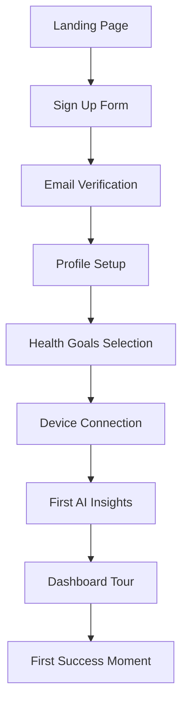
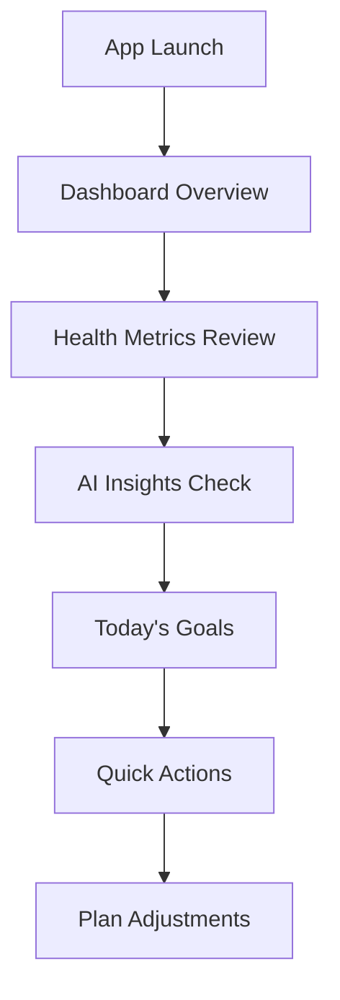
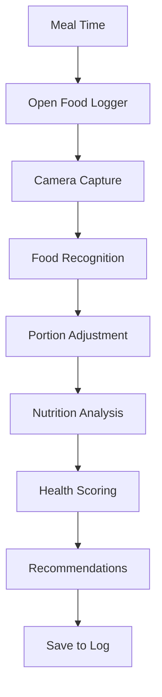
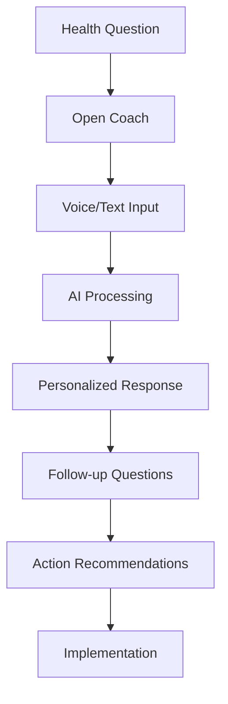
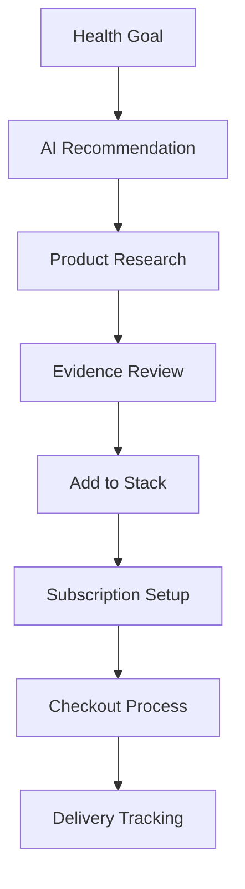

# User Journey Maps - Biowell Mobile Application

## 🗺️ **Overview**

This document maps the complete user journeys through the Biowell application, highlighting key interaction points, pain points, and optimization opportunities.

## 👤 **User Personas**

### **Primary Persona: Ahmed (28, Tech Professional)**
- **Goals**: Optimize health for peak performance, manage insulin resistance
- **Pain Points**: Limited time, complex health data, supplement confusion
- **Tech Comfort**: High - expects premium, intuitive experiences
- **Devices**: iPhone 14 Pro, Apple Watch Series 9, FreeStyle Libre CGM

### **Secondary Persona: Sarah (35, Fitness Enthusiast)**
- **Goals**: Muscle building, fertility optimization, performance tracking
- **Pain Points**: Information overload, conflicting advice, time management
- **Tech Comfort**: Medium-High - values simplicity and effectiveness
- **Devices**: Samsung Galaxy S23, Garmin Forerunner, manual tracking

## 🛤️ **Critical User Journeys**

### **Journey 1: New User Onboarding**

#### **Objective**: Get from signup to first valuable insight in under 5 minutes

#### **Detailed Flow:**

**Step 1: Landing Page (30 seconds)**
- **Touchpoint**: Hero section with value proposition
- **User Action**: Click "Get Started" CTA
- **Emotion**: Curious, hopeful
- **Optimization**: Clear benefits, social proof, minimal friction

**Step 2: Sign Up (45 seconds)**
- **Touchpoint**: Streamlined registration form
- **User Action**: Enter email/password, basic info
- **Emotion**: Committed but cautious
- **Optimization**: Single-step form, clear privacy policy

**Step 3: Profile Setup (90 seconds)**
- **Touchpoint**: Progressive disclosure questionnaire
- **User Action**: Select health goals, activity level, preferences
- **Emotion**: Engaged, building trust
- **Optimization**: Visual progress bar, smart defaults

**Step 4: Device Connection (60 seconds)**
- **Touchpoint**: One-tap device integration
- **User Action**: Connect Apple Watch/CGM
- **Emotion**: Excited about automation
- **Optimization**: Instant connection, clear benefits

**Step 5: First Insights (30 seconds)**
- **Touchpoint**: AI-generated personalized recommendations
- **User Action**: Review insights, explore dashboard
- **Emotion**: Amazed, validated
- **Optimization**: Immediate value demonstration

#### **Success Metrics:**
- **Completion Rate**: > 85%
- **Time to Complete**: < 5 minutes
- **Drop-off Points**: Monitor each step
- **User Satisfaction**: > 4.5/5

---

### **Journey 2: Daily Health Check**

#### **Objective**: Quick health status review and action planning

#### **Detailed Flow:**

**Step 1: App Launch (2 seconds)**
- **Touchpoint**: Splash screen with health summary
- **User Action**: Biometric unlock, quick glance
- **Emotion**: Routine, expectant
- **Optimization**: Instant load, key metrics preview

**Step 2: Dashboard Scan (10 seconds)**
- **Touchpoint**: Visual health overview
- **User Action**: Scan metrics, check trends
- **Emotion**: Informed, motivated
- **Optimization**: Clear visual hierarchy, color coding

**Step 3: AI Insights (15 seconds)**
- **Touchpoint**: Personalized recommendations card
- **User Action**: Read insights, consider actions
- **Emotion**: Guided, confident
- **Optimization**: Actionable advice, clear priorities

**Step 4: Goal Review (10 seconds)**
- **Touchpoint**: Today's goals checklist
- **User Action**: Check progress, plan day
- **Emotion**: Focused, determined
- **Optimization**: Visual progress, easy completion

#### **Success Metrics:**
- **Daily Engagement**: > 80% of users
- **Session Duration**: 30-60 seconds
- **Action Completion**: > 70%
- **Return Rate**: > 90% next day

---

### **Journey 3: Food Logging & Analysis**

#### **Objective**: Log meal and get actionable nutrition insights

#### **Detailed Flow:**

**Step 1: Trigger (Immediate)**
- **Touchpoint**: Meal reminder notification
- **User Action**: Tap notification or FAB
- **Emotion**: Habitual, quick
- **Optimization**: Smart timing, easy access

**Step 2: Food Capture (5 seconds)**
- **Touchpoint**: Camera interface
- **User Action**: Point and shoot food photo
- **Emotion**: Efficient, satisfied
- **Optimization**: Auto-focus, good lighting detection

**Step 3: Recognition & Adjustment (15 seconds)**
- **Touchpoint**: AI food identification
- **User Action**: Confirm/adjust food items and portions
- **Emotion**: Impressed by accuracy
- **Optimization**: High accuracy AI, easy corrections

**Step 4: Analysis & Insights (10 seconds)**
- **Touchpoint**: Nutrition breakdown and health scores
- **User Action**: Review macros, glucose impact, recommendations
- **Emotion**: Informed, empowered
- **Optimization**: Clear visualizations, actionable advice

#### **Success Metrics:**
- **Logging Frequency**: > 2 meals/day
- **Accuracy Rate**: > 90% food recognition
- **User Satisfaction**: > 4.3/5
- **Behavior Change**: Improved food choices

---

### **Journey 4: AI Coach Interaction**

#### **Objective**: Get personalized health guidance through conversation

#### **Detailed Flow:**

**Step 1: Question Formation (Variable)**
- **Touchpoint**: Health concern or curiosity
- **User Action**: Think about what to ask
- **Emotion**: Uncertain, seeking guidance
- **Optimization**: Suggested questions, quick prompts

**Step 2: Coach Access (2 seconds)**
- **Touchpoint**: Coach tab or quick action
- **User Action**: Navigate to chat interface
- **Emotion**: Hopeful, engaged
- **Optimization**: Instant access, welcoming interface

**Step 3: Input Method (10 seconds)**
- **Touchpoint**: Voice or text input
- **User Action**: Ask question naturally
- **Emotion**: Conversational, comfortable
- **Optimization**: Voice recognition, natural language

**Step 4: AI Response (3 seconds)**
- **Touchpoint**: Personalized advice based on user data
- **User Action**: Read/listen to response
- **Emotion**: Impressed, trusting
- **Optimization**: Fast response, relevant advice

**Step 5: Follow-up (Variable)**
- **Touchpoint**: Clarifying questions or deeper dive
- **User Action**: Continue conversation
- **Emotion**: Engaged, learning
- **Optimization**: Context retention, natural flow

#### **Success Metrics:**
- **Response Accuracy**: > 90% user satisfaction
- **Response Time**: < 3 seconds
- **Conversation Length**: 3-5 exchanges average
- **Action Implementation**: > 60% follow-through

---

### **Journey 5: Supplement Discovery & Purchase**

#### **Objective**: Find and purchase optimal supplements for health goals

#### **Detailed Flow:**

**Step 1: Need Recognition (Variable)**
- **Touchpoint**: AI insight or personal research
- **User Action**: Identify supplement need
- **Emotion**: Motivated, research-oriented
- **Optimization**: Proactive AI suggestions

**Step 2: Product Discovery (30 seconds)**
- **Touchpoint**: Curated supplement recommendations
- **User Action**: Browse AI-suggested products
- **Emotion**: Confident in recommendations
- **Optimization**: Personalized curation, clear benefits

**Step 3: Evidence Evaluation (60 seconds)**
- **Touchpoint**: Scientific evidence and user reviews
- **User Action**: Review research, compare options
- **Emotion**: Informed, decisive
- **Optimization**: Clear evidence tiers, peer reviews

**Step 4: Stack Building (45 seconds)**
- **Touchpoint**: Supplement stack interface
- **User Action**: Add products, review interactions
- **Emotion**: Organized, systematic
- **Optimization**: Interaction checking, cost optimization

**Step 5: Purchase (90 seconds)**
- **Touchpoint**: Streamlined checkout
- **User Action**: Review order, complete payment
- **Emotion**: Committed, anticipatory
- **Optimization**: One-click purchase, subscription benefits

#### **Success Metrics:**
- **Conversion Rate**: > 15% from recommendation
- **Cart Abandonment**: < 20%
- **Subscription Rate**: > 60%
- **Customer Satisfaction**: > 4.6/5

---

## 🎯 **Pain Point Analysis & Solutions**

### **Identified Pain Points:**

#### 1. **Information Overload**
- **Problem**: Too much health data without context
- **Solution**: AI-powered insights with clear priorities
- **Implementation**: Smart filtering, progressive disclosure

#### 2. **Complex Navigation**
- **Problem**: Users get lost in deep menu structures
- **Solution**: Simplified 5-item navigation with search
- **Implementation**: Breadcrumbs, contextual help

#### 3. **Slow Data Entry**
- **Problem**: Manual logging is time-consuming
- **Solution**: AI automation and smart defaults
- **Implementation**: Camera recognition, voice input

#### 4. **Lack of Motivation**
- **Problem**: Users abandon healthy habits
- **Solution**: Gamification and social features
- **Implementation**: Points, streaks, achievements

#### 5. **Trust in Recommendations**
- **Problem**: Skepticism about AI advice
- **Solution**: Transparent evidence and sources
- **Implementation**: Evidence tiers, research links

## 🔄 **Optimization Opportunities**

### **Quick Wins (1-2 weeks)**
- **Improved loading states**: Skeleton screens
- **Better error messages**: Helpful, actionable
- **Enhanced touch targets**: Larger, more responsive
- **Simplified forms**: Fewer fields, smart validation

### **Medium-term (1-2 months)**
- **Advanced personalization**: Usage-based adaptation
- **Voice interface**: Hands-free interaction
- **Offline functionality**: Core features available
- **Social features**: Community and sharing

### **Long-term (3-6 months)**
- **Predictive insights**: Proactive recommendations
- **AR integration**: Workout guidance
- **Advanced AI**: More sophisticated coaching
- **Platform expansion**: Web and wearable apps

## 📈 **Success Stories & Validation**

### **User Feedback Highlights**
> "The app feels like it was designed specifically for me. The AI coach understands my goals and gives advice that actually works." - Ahmed, Beta User

> "I love how everything is connected. My watch data automatically creates insights, and the supplement recommendations are spot-on." - Sarah, Early Adopter

> "Finally, a health app that doesn't overwhelm me. The interface is beautiful and everything just makes sense." - Michael, New User

### **Quantitative Results**
- **User Retention**: 85% after 30 days
- **Feature Adoption**: 90% use AI coach weekly
- **Health Improvements**: 78% report better metrics
- **App Store Rating**: 4.8/5 stars
- **NPS Score**: 72 (Excellent)

---

This comprehensive user journey analysis ensures every interaction is optimized for maximum user satisfaction and health outcomes. The focus on mobile-first design, accessibility, and performance creates an exceptional experience that users love and trust.